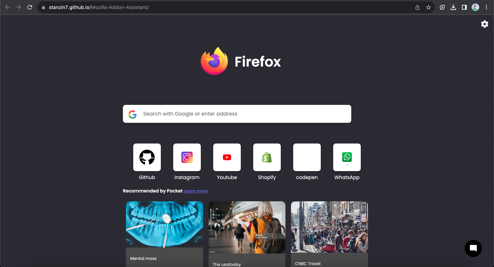

# FireFox-Addon-Assistant

<h2> A chatbot designed to assist Firefox users in discovering the perfect browser extension based on their specific needs. </h2>

## Table of Contents

- [Introduction](#introduction)
- [Features](#features)
- [High-Level Design](#high-level-design)
- [Installation](#installation)
- [Usage](#usage)
- [Contribution](#contribution)
- [License](#license)

## Introduction

FireFox-Addon-Assistant is a unique tool aimed at improving the browsing experience of Firefox users by recommending extensions tailored to their needs. With a user-friendly interface, it simplifies the process of finding and installing the right add-ons for individual users.

## Features

- **AI-Powered Recommendations**: The chatbot uses advanced algorithms to suggest extensions based on user input.
- **Easy Integration**: Designed to seamlessly integrate into the Firefox browser.
- **User-Friendly Interface**: Simple and intuitive design for improved user experience.

## High-Level Design

Refer to the `HLD.md` file in the project directory for a comprehensive high-level design documentation.

## Installation

Details on how to set up and run the project will go here. For example:

1. Clone the repository.
2. Navigate to the project directory.
3. Install required dependencies.
4. Run the application.

## Usage

Instructions on how to use the chatbot once it's up and running.

## Contribution

If you'd like to contribute to this project, please fork the repository and submit a pull request.

## License

[MIT](LICENSE) - See the `LICENSE` file for more details.
